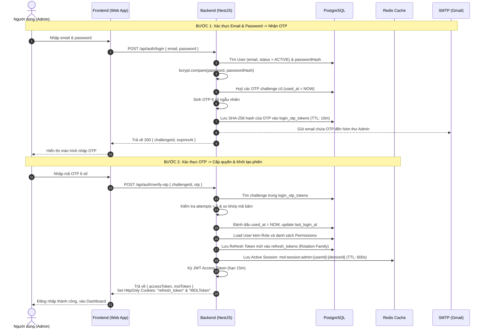

# Quy trình Đăng nhập & Quản lý Phiên (Authentication & Session Flow)

Tài liệu chi tiết được đặt tại: [docs/login-flow.md](./docs/login-flow.md)

Xem sơ đồ tóm tắt:

```mermaid
sequenceDiagram
    autonumber
    actor Admin as Người dùng (Admin)
    participant Web as Frontend (Web App)
    participant API as Backend (NestJS)
    participant DB as PostgreSQL
    participant Redis as Redis Cache
    participant Mail as SMTP (Gmail)

    %% BƯỚC 1: REQUEST OTP
    Note over Admin,Mail: BƯỚC 1: Xác thực Email & Password -> Nhận OTP
    Admin->>Web: Nhập email & password
    Web->>API: POST /api/auth/login { email, password }
    API->>DB: Tìm User (email, status = ACTIVE) & passwordHash
    API->>API: bcrypt.compare(password, passwordHash)
    API->>DB: Huỷ các OTP challenge cũ (used_at = NOW)
    API->>API: Sinh OTP 6 số ngẫu nhiên
    API->>DB: Lưu SHA-256 hash của OTP vào login_otp_tokens (TTL: 10m)
    API-->>Mail: Gửi email chứa OTP đến hòm thư Admin
    API-->>Web: Trả về 200 { challengeId, expiresAt }
    Web-->>Admin: Hiển thị màn hình nhập OTP

    %% BƯỚC 2: VERIFY OTP
    Note over Admin,Redis: BƯỚC 2: Xác thực OTP -> Cấp quyền & Khởi tạo phiên
    Admin->>Web: Nhập mã OTP 6 số
    Web->>API: POST /api/auth/verify-otp { challengeId, otp }
    API->>DB: Tìm challenge trong login_otp_tokens
    API->>API: Kiểm tra attempts < 5 & so khớp mã băm
    API->>DB: Đánh dấu used_at = NOW, update last_login_at
    API->>DB: Load User kèm Role và danh sách Permissions
    
    %% Khởi tạo Tokens & Redis
    API->>DB: Lưu Refresh Token mới vào refresh_tokens (Rotation Family)
    API->>Redis: Lưu Active Session: mol:session:admin:{userId}:{deviceId} (TTL: 600s)
    API->>API: Ký JWT Access Token (hạn 15m)
    API-->>Web: Trả về { accessToken, molToken }<br/>Set HttpOnly Cookies: "refresh_token" & "MOLToken"
    Web-->>Admin: Đăng nhập thành công, vào Dashboard
```
