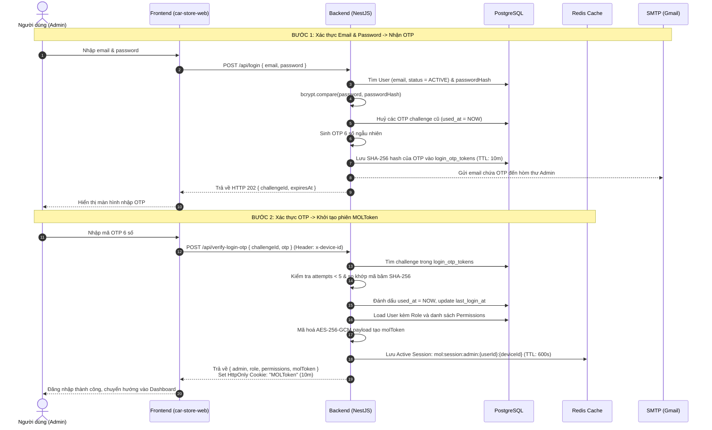

# Quy trình Đăng nhập & Quản lý Phiên (Authentication & Session Flow)

Tài liệu chi tiết được đặt tại: [docs/login-flow.md](./docs/login-flow.md)

Hệ thống sử dụng cơ chế xác thực phiên **MOLToken (AES-256-GCM Encrypted Token + In-Memory Redis Session)** giống chuẩn `car-store-api` và tương thích 100% với `car-store-web`.

### Sơ đồ luồng đăng nhập

