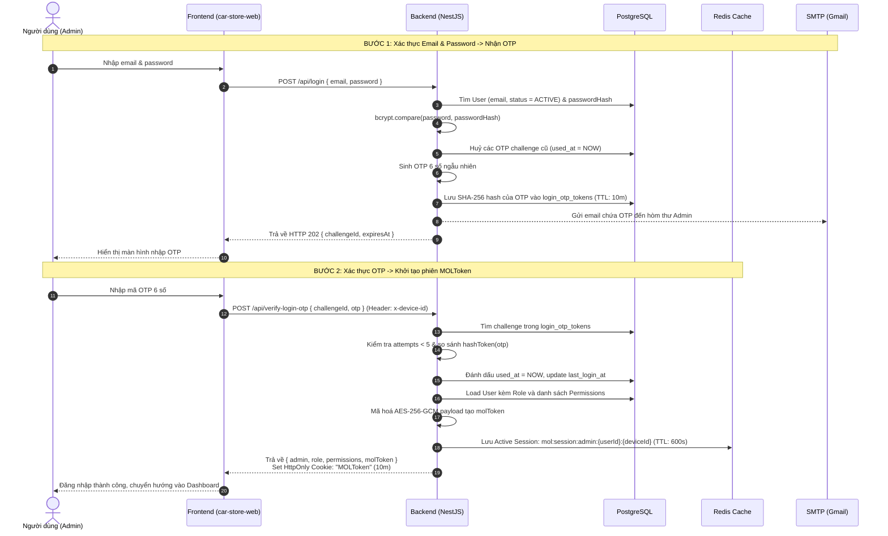

# Quy trình Đăng nhập & Quản lý Phiên (Authentication & Session Flow)

> **Tài liệu kỹ thuật hệ thống Carstore Backend (NestJS + PostgreSQL + Redis)**  
> **Phiên bản:** 3.0 (Pure MOLToken AES-256-GCM + In-Memory Redis Session)  
> **Áp dụng cho:** `car-store-backend` (đồng bộ hoàn toàn với `car-store-api` và frontend `car-store-web`)

---

## 1. Tổng quan kiến trúc xác thực

Hệ thống sử dụng cơ chế **Xác thực 2 bước (Two-Factor Authentication / OTP Login)** kết hợp **MOLToken Session** mã hóa đối xứng AES-256-GCM và lưu trạng thái phiên hoạt động trên **Redis Cache**:

- **Không sử dụng JWT Access Token** và **Không sử dụng Refresh Token** truyền thống.
- **Duy nhất 1 loại Token phiên:** `MOLToken` được mã hóa đối xứng AES-256-GCM.
- **Bảo mật kép:** Trình duyệt lưu `MOLToken` trong **HttpOnly Cookie** (hoặc gửi qua header `Authorization: MOLToken <token>`), đồng thời Redis lưu trữ trạng thái phiên hoạt động với TTL 600 giây (10 phút).
- **Hỗ trợ đa đường dẫn (Dual Routing):** Hỗ trợ cả 2 chuẩn gọi API:
  - Chuẩn gốc của `car-store-web`: `/api/login`, `/api/verify-login-otp`, `/api/refresh-token`, v.v.
  - Chuẩn module NestJS: `/api/auth/login`, `/api/auth/verify-otp`, `/api/auth/refresh`, v.v.



---

## 2. Chi tiết từng bước & API Endpoints

### Bước 1: Yêu cầu mã OTP (`POST /api/login`)

- **Mục đích:** Xác thực email & password ban đầu, sau đó phát hành mã OTP qua email.
- **Request:**
  ```http
  POST /api/login
  Content-Type: application/json

  {
    "email": "admin@carstore.com",
    "password": "Admin@123456"
  }
  ```
- **Xử lý Backend:**
  1. Chuẩn hoá email: `trim().toLowerCase()`.
  2. Truy vấn tài khoản trong bảng `users`:
     - Kiểm tra `status === 'ACTIVE'` và `deleted_at IS NULL`.
     - So sánh mật khẩu bằng `bcrypt.compare(password, user.passwordHash)`.
     - _Bảo mật Timing Attack:_ Nếu email không tồn tại hoặc sai mật khẩu, hệ thống đều trả về lỗi chung `401 INVALID_CREDENTIALS` (hoặc `Invalid email or password`).
  3. Huỷ toàn bộ OTP challenge đang hoạt động trước đó của user (`used_at = NOW()`).
  4. Sinh mã OTP ngẫu nhiên 6 chữ số (từ `100000` đến `999999`).
  5. Tính mã băm `code_hash = SHA256(otp)` và lưu vào bảng `login_otp_tokens`:
     - `expires_at = NOW() + LOGIN_OTP_TTL_MINUTES` (mặc định 10 phút).
     - `attempts = 0`.
  6. Gửi email chứa mã OTP thông qua `MailService` (SMTP Gmail).
- **Response thành công (HTTP 202 Accepted):**
  ```json
  {
    "data": {
      "challengeId": "3fa85f64-5717-4562-b3fc-2c963f66afa6",
      "expiresAt": "2026-09-17T15:45:00.000Z"
    },
    "requestId": "req_01j..."
  }
  ```

---

### Bước 2: Xác thực mã OTP (`POST /api/verify-login-otp`)

- **Mục đích:** Kiểm tra mã OTP, tạo phiên mã hóa `MOLToken`, lưu session vào Redis và thiết lập cookie.
- **Request:**
  ```http
  POST /api/verify-login-otp
  Content-Type: application/json
  x-device-id: 8f9b4c2e-1234-5678-abcd-ef0123456789 (optional)

  {
    "challengeId": "3fa85f64-5717-4562-b3fc-2c963f66afa6",
    "otp": "654321"
  }
  ```
- **Xử lý Backend:**
  1. Tìm challenge trong bảng `login_otp_tokens` theo `id = challengeId`:
     - Điều kiện: `used_at IS NULL` và `expires_at > NOW()`.
     - Nếu không tìm thấy $\rightarrow$ Báo lỗi `401 INVALID_LOGIN_OTP`.
  2. Kiểm tra số lần thử sai:
     - Nếu `attempts >= 5` $\rightarrow$ Đánh dấu huỷ OTP và trả về `429 LOGIN_OTP_ATTEMPTS_EXCEEDED`.
  3. So sánh `SHA256(otp)` với `code_hash` trong DB:
     - Nếu sai: Tăng `attempts + 1`. Nếu đạt 5 lần thì khoá OTP $\rightarrow$ Trả về `401`.
  4. Khi mã OTP chính xác:
     - Đánh dấu `used_at = NOW()`.
     - Cập nhật `last_login_at = NOW()` trên bảng `users`.
     - Tải thông tin Role và danh sách Permissions của User.
  5. **Tạo `MOLToken` và Session Redis:**
     - Đóng gói payload:
       ```json
       {
         "audience": "admin",
         "userId": "user-uuid",
         "roleCode": "SUPER_ADMIN",
         "permissions": ["cars.view", "cars.create", ...],
         "authLevel": "SUPER_ADMIN",
         "deviceId": "device-uuid",
         "tokenVersion": 0,
         "timestamp": 1789648800
       }
       ```
     - Mã hóa payload bằng thuật toán **AES-256-GCM** với khoá `SHA-256(MOL_TOKEN_ENCRYPTION_SECRET)`:
       $\rightarrow$ Format chuỗi: `base64url(iv).base64url(authTag).base64url(ciphertext)`.
     - Lưu active session vào **Redis**:
       - Key: `mol:session:admin:{userId}:{deviceId}`
       - Value: JSON `{ "deviceId": "device-uuid", "tokenHash": "SHA256(molToken)" }`
       - TTL: 600 giây (10 phút).
     - Thiết lập cookie `MOLToken`:
       - `HttpOnly: true`, `SameSite: "lax"`, `Path: "/api"`, `MaxAge: 600000 ms`.
- **Response thành công (HTTP 200 OK):**
  ```json
  {
    "data": {
      "admin": {
        "id": "7c9e6679-7425-40de-944b-e07fc1f90ae7",
        "email": "admin@carstore.com",
        "username": "admin",
        "fullName": "Super Admin",
        "avatarUrl": null,
        "phone": null,
        "status": "ACTIVE",
        "lastLoginAt": "2026-09-17T15:00:00.000Z",
        "createdAt": "2026-09-01T00:00:00.000Z",
        "updatedAt": "2026-09-17T15:00:00.000Z"
      },
      "role": "SUPER_ADMIN",
      "permissions": ["cars.view", "cars.create", ...],
      "molToken": "aV9k...authTag...encryptedPayload"
    },
    "requestId": "req_01j..."
  }
  ```
  _(Trình duyệt đồng thời nhận Set-Cookie `MOLToken`)._

---

### Bước 3: Gửi lại mã OTP (`POST /api/resend-login-otp`)

- **Mục đích:** Huỷ challenge cũ và gửi mã OTP mới nếu mã cũ quá hạn hoặc chưa nhận được email.
- **Request:**
  ```http
  POST /api/resend-login-otp
  Content-Type: application/json

  {
    "challengeId": "3fa85f64-5717-4562-b3fc-2c963f66afa6"
  }
  ```
- **Response thành công (HTTP 200):**
  ```json
  {
    "data": {
      "challengeId": "8da85f64-1234-4562-b3fc-2c963f66cce8",
      "expiresAt": "2026-09-17T15:55:00.000Z"
    },
    "requestId": "req_01j..."
  }
  ```

---

### Bước 4: Gia hạn phiên làm việc (`POST /api/refresh-token`)

- **Cơ chế gia hạn của `car-store-api` & `car-store-web`:**
  - Client gọi `POST /api/refresh-token` gửi kèm Cookie `MOLToken` (hoặc header `Authorization: MOLToken <token>`).
  - Backend giải mã token và xác thực session trên Redis.
  - Backend kéo dài thời hạn sống của key Redis thêm 600 giây:
    ```typescript
    EXPIRE mol:session:admin:{userId}:{deviceId} 600
    ```
  - Ghi đè lại cookie `MOLToken` với thời hạn mới 600 giây.
  - Trả về token hiện tại.
- **Response thành công (HTTP 200):**
  ```json
  {
    "data": {
      "molToken": "aV9k...authTag...encryptedPayload"
    },
    "requestId": "req_01j..."
  }
  ```

---

### Bước 5: Đăng xuất (Logout)

#### 1. Đăng xuất trên thiết bị hiện tại (`POST /api/logout`)
- Lấy `MOLToken` từ header hoặc cookie.
- Giải mã lấy `userId` và `deviceId`.
- Xoá key phiên trong Redis:
  ```redis
  DEL mol:session:admin:{userId}:{deviceId}
  ```
- Xoá cookie `MOLToken` trên trình duyệt (`Max-Age: 0`).
- Trả về `{ message: "Logged out successfully" }`.

#### 2. Đăng xuất khỏi tất cả thiết bị (`POST /api/logout-all`)
- Quét và xoá toàn bộ key session Redis của user:
  ```redis
  SCAN mol:session:admin:{userId}:* -> DEL
  ```
- **Tăng `token_version` thêm 1** trong bảng `users` (PostgreSQL):
  - Bất kỳ `MOLToken` nào còn lưu hành đều bị từ chối ngay lập tức tại `MolAuthGuard` vì:
    `user.tokenVersion !== tokenData.tokenVersion`.
- Xoá cookie `MOLToken`.
- Trả về `{ message: "All sessions have been revoked" }`.

---

### Bước 6: Các API người dùng khác

1. **Lấy hồ sơ cá nhân (`GET /api/profile`):**
   - Đọc phiên từ cookie `MOLToken`.
   - Trả về: `{ admin, role, permissions }`.
2. **Cập nhật thông tin cá nhân (`PATCH /api/profile`):**
   - Body: `{ fullName?, avatarUrl?, phone? }`.
3. **Đổi mật khẩu (`POST /api/change-password`):**
   - Body: `{ currentPassword, newPassword }`.
   - Cập nhật mật khẩu mới, sau đó tự động gọi `logoutAll` (tăng `tokenVersion` và xoá toàn bộ Redis key).
4. **Quên mật khẩu (`POST /api/forgot-password` & `POST /api/reset-password`):**
   - Tạo token đặt lại mật khẩu trong bảng `password_reset_tokens` và gửi email.
   - Nhập token + mật khẩu mới để đặt lại mật khẩu và huỷ các phiên cũ.

---

## 3. Bảng tổng hợp các Token & Cookie

| Tên Token / Cookie | Nơi lưu trữ                         | Thời hạn             | Cơ chế mã hoá / Bảo mật                       | Mục đích sử dụng                                                                   |
| ------------------ | ----------------------------------- | -------------------- | --------------------------------------------- | ---------------------------------------------------------------------------------- |
| **`MOLToken`**     | **Redis in-memory** (`mol:session:*`) | 10 phút (tự gia hạn) | **AES-256-GCM** đối xứng; Cookie `HttpOnly`  | Nhận diện người dùng, phân quyền RBAC, duy trì phiên tốc độ cao in-memory          |
| **OTP Code**       | PostgreSQL (`login_otp_tokens`)     | 10 phút              | Băm `SHA-256`, giới hạn tối đa 5 lần thử      | Xác thực 2 bước (2FA) bảo vệ tài khoản qua email                                   |

---

## 4. Các tính năng an toàn bảo mật (Security Safeguards)

1. **Mã hoá đối xứng AES-256-GCM Authenticated Encryption:**
   - Dữ liệu session chứa role, permissions, deviceId, tokenVersion được đóng gói và mã hóa. Mọi hành vi sửa đổi trái phép trên token đều bị phát hiện ngay lập tức bởi GCM authTag.
2. **Kiểm tra Device ID Binding:**
   - Mỗi token được gắn với 1 `deviceId` duy nhất (qua header `x-device-id`). Token bị sao chép sang thiết bị khác sẽ bị phát hiện và từ chối.
3. **Thu hồi phiên tức thì qua Redis & Token Version:**
   - Khi đổi mật khẩu hoặc `logout-all`, việc tăng `tokenVersion` trong database lập tức làm vô hiệu toàn bộ các token đã mã hóa đang lưu hành trên toàn thế giới mà không cần chờ thời gian hết hạn.
4. **Bảo mật Cookie:**
   - Cookie `MOLToken` sử dụng `HttpOnly: true` (chống đọc trộm qua XSS), `SameSite: "lax"`, và `Path: "/api"`.
5. **Che giấu thông tin nhạy cảm:**
   - Cột `password_hash`, `token_version` luôn bị ẩn (`select: false`), không bao giờ rò rỉ trong API response.
