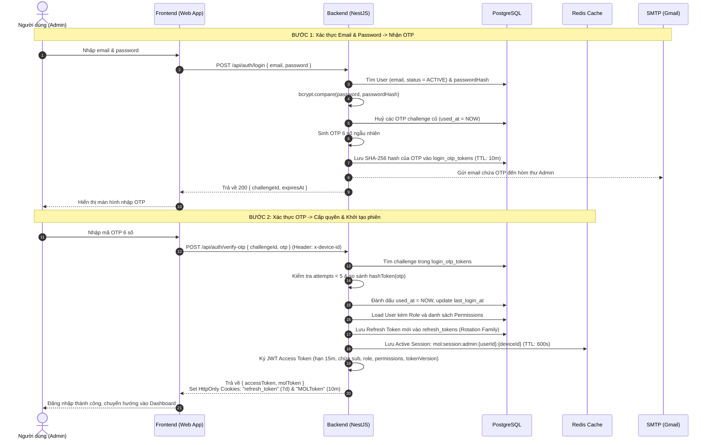

# Quy trình Đăng nhập & Quản lý Phiên (Authentication & Session Flow)

> **Tài liệu kỹ thuật hệ thống Carstore Backend (NestJS + PostgreSQL + Redis)**  
> **Phiên bản:** 1.0  
> **Áp dụng cho:** `car-store-backend` (và tích hợp với `car-store-web`)

---

## 1. Tổng quan kiến trúc xác thực

Hệ thống sử dụng cơ chế **Xác thực 2 bước (Two-Factor Authentication / OTP Login)** kết hợp hệ thống **Dual-Token & Session Cache**:



---

## 2. Chi tiết từng bước & API Endpoints

### Bước 1: Yêu cầu mã OTP (`POST /api/auth/login`)

- **Mục đích:** Kiểm tra thông tin đăng nhập ban đầu và phát hành mã OTP qua email.
- **Request:**
  ```http
  POST /api/auth/login
  Content-Type: application/json

  {
    "email": "admin@carstore.com",
    "password": "Admin@123456"
  }
  ```
- **Xử lý Backend:**
  1. Chuẩn hoá email: `trim().toLowerCase()`.
  2. Truy vấn tài khoản trong bảng `users`:
     - Kiểm tra `status === 'ACTIVE'` và `deleted_at IS NULL`.
     - So sánh mật khẩu bằng `bcrypt.compare(password, user.passwordHash)`.
     - *Bảo mật Timing Attack:* Nếu email không tồn tại hoặc sai mật khẩu, hệ thống đều trả về lỗi chung `401 INVALID_CREDENTIALS` (không làm lộ việc email có tồn tại hay không).
  3. Huỷ toàn bộ OTP challenge đang hoạt động trước đó của user (`used_at = NOW()`).
  4. Sinh mã OTP ngẫu nhiên 6 chữ số (từ `100000` đến `999999`).
  5. Tính mã băm `code_hash = SHA256(otp)` và lưu vào bảng `login_otp_tokens`:
     - `expires_at = NOW() + LOGIN_OTP_TTL_MINUTES` (mặc định 10 phút).
     - `attempts = 0`.
  6. Gửi email chứa mã OTP thông qua `MailService` (SMTP Gmail).
- **Response thành công (HTTP 200 / 202):**
  ```json
  {
    "data": {
      "challengeId": "3fa85f64-5717-4562-b3fc-2c963f66afa6",
      "expiresAt": "2026-09-17T15:45:00.000Z"
    },
    "requestId": "req_01j..."
  }
  ```

---

### Bước 2: Xác thực mã OTP (`POST /api/auth/verify-otp`)

- **Mục đích:** Kiểm tra mã OTP, tạo phiên làm việc, cấp JWT và đồng bộ session vào Redis.
- **Request:**
  ```http
  POST /api/auth/verify-otp
  Content-Type: application/json
  x-device-id: 8f9b4c2e-1234-5678-abcd-ef0123456789 (optional)

  {
    "challengeId": "3fa85f64-5717-4562-b3fc-2c963f66afa6",
    "otp": "654321"
  }
  ```
- **Xử lý Backend:**
  1. Tìm challenge trong bảng `login_otp_tokens` theo `id = challengeId`:
     - Điều kiện: `used_at IS NULL` và `expires_at > NOW()`.
     - Nếu không tìm thấy $\rightarrow$ Báo lỗi `401 INVALID_LOGIN_OTP`.
  2. Kiểm tra số lần thử sai:
     - Nếu `attempts >= 5` $\rightarrow$ Đánh dấu huỷ OTP và trả về `429 LOGIN_OTP_ATTEMPTS_EXCEEDED`.
  3. So sánh `SHA256(otp)` với `code_hash` trong DB:
     - Nếu sai: Tăng `attempts + 1`. Nếu đạt 5 lần thì khoá OTP $\rightarrow$ Trả về `401`.
  4. Khi mã OTP chính xác:
     - Đánh dấu `used_at = NOW()`.
     - Cập nhật `last_login_at = NOW()` trên bảng `users`.
     - Tải thông tin Role và danh sách Permissions hiệu lực của Admin.
  5. **Cấp phát 3 lớp Token & Session:**
     - **Lớp 1 — PostgreSQL Refresh Token:**
       - Sinh mã ngẫu nhiên 32 bytes, lưu hash SHA-256 vào bảng `refresh_tokens`.
       - Gắn `family_id` (đại diện phiên của thiết bị để phát hiện token bị trộm).
       - Gửi về client qua **HttpOnly Cookie** `refresh_token` (hạn 7 ngày, `SameSite=Strict`).
     - **Lớp 2 — Redis MOL Session:**
       - Mã hoá payload phiên bằng thuật toán **AES-256-GCM** (sử dụng `MOL_TOKEN_ENCRYPTION_SECRET`):
         `{ audience: "admin", userId, roleCode, permissions, deviceId, tokenVersion, timestamp }`.
       - Lưu vào **Redis** key: `mol:session:admin:{userId}:{deviceId}` với data `{ deviceId, tokenHash }`, TTL 600 giây (10 phút).
       - Gửi về client qua **HttpOnly Cookie** `MOLToken`.
     - **Lớp 3 — JWT Access Token:**
       - Ký JWT ngắn hạn (15 phút) chứa `{ sub, email, role, permissions, tokenVersion, jti }`.
- **Response thành công (HTTP 200):**
  ```json
  {
    "data": {
      "accessToken": "eyJhbGciOiJIUzI1NiIsInR5c...",
      "molToken": "iv.authTag.encryptedContent"
    },
    "requestId": "req_01j..."
  }
  ```
  *(Đồng thời trình duyệt tự động nhận 2 Set-Cookie: `refresh_token` và `MOLToken`).*

---

### Bước 3: Gửi lại mã OTP (`POST /api/auth/resend-otp`)

- **Mục đích:** Yêu cầu cấp mã OTP mới khi mã cũ hết hạn hoặc không nhận được email.
- **Request:**
  ```http
  POST /api/auth/resend-otp
  Content-Type: application/json

  {
    "challengeId": "3fa85f64-5717-4562-b3fc-2c963f66afa6"
  }
  ```

---

### Bước 4: Gia hạn phiên (Token Refreshing)

Hệ thống hỗ trợ 2 cơ chế gia hạn song song:

#### 1. Xoay vòng Refresh Token (`POST /api/auth/refresh`)
- Trình duyệt tự gửi cookie `refresh_token`.
- Backend kiểm tra trong bảng `refresh_tokens`:
  - **Phát hiện Token bị đánh cắp (Reuse / Replay Detection):** Nếu token gửi lên là token đã từng bị thu hồi trước đó (`revoked_at IS NOT NULL`), hệ thống lập tức **huỷ toàn bộ nhóm token cùng `family_id`** và từ chối truy cập `401`.
  - Nếu token hợp lệ:
    1. Đánh dấu thu hồi token hiện tại (`revoked_at = NOW()`, `replaced_by_id = newToken.id`).
    2. Sinh Refresh Token mới kế thừa `family_id` cũ.
    3. Ghi đè cookie `refresh_token` mới và cấp Access Token mới.

#### 2. Gia hạn Redis MOL Session (`POST /api/auth/refresh-token`)
- Kiểm tra cookie `MOLToken` trong Redis:
  - Nếu session còn hợp lệ trên Redis, tự động reset thời gian sống (TTL) thêm 600 giây (`EXPIRE`).

---

### Bước 5: Đăng xuất (Logout)

#### 1. Đăng xuất trên thiết bị hiện tại (`POST /api/auth/logout`)
- Đánh dấu `revoked_at = NOW()` cho Refresh Token hiện tại trong PostgreSQL.
- Xoá key phiên trong Redis: `DEL mol:session:admin:{userId}:{deviceId}`.
- Xoá 2 cookies `refresh_token` và `MOLToken`.

#### 2. Đăng xuất khỏi tất cả thiết bị (`POST /api/auth/logout-all`)
- Thu hồi tất cả Refresh Token của user trong PostgreSQL.
- Quét và xoá toàn bộ key Redis của user: `SCAN mol:session:admin:{userId}:*` $\rightarrow$ `DEL`.
- **Tăng `token_version` thêm 1** trong bảng `users`:
  $\rightarrow$ Ngay lập tức vô hiệu hoá toàn bộ JWT Access Token cũ ở bất kỳ đâu, vì `JwtStrategy` kiểm tra `payload.tokenVersion === user.tokenVersion`.
- Xoá cookies trên thiết bị hiện tại.

---

## 3. Bảng tổng hợp các Cookie & Token

| Tên Token / Cookie | Nơi lưu trữ | Thời hạn | Thuộc tính bảo mật | Mục đích sử dụng |
|---|---|---|---|---|
| **Access Token** | Bộ nhớ RAM Client (hoặc Bearer Header) | 15 phút | `Authorization: Bearer <token>` | Gọi các API yêu cầu xác thực và phân quyền RBAC |
| **`refresh_token`** | PostgreSQL (`refresh_tokens`) | 7 ngày | `HttpOnly`, `SameSite=Strict`, `Secure` | Tự động xoay vòng cấp mới Access Token mà không cần đăng nhập lại |
| **`MOLToken`** | Redis RAM (`mol:session:*`) | 10 phút (tự gia hạn) | `HttpOnly`, `SameSite=Strict`, `Secure` | Quản lý phiên tức thời, tương thích cơ chế phiên tốc độ cao giống `car-store-api` |
| **OTP Code** | PostgreSQL (`login_otp_tokens`) | 10 phút | Lưu dưới dạng băm `SHA-256`, tối đa 5 lần thử | Xác thực 2 bước qua email |

---

## 4. Các tính năng bảo mật tích hợp (Security Safeguards)

1. **Chống Brute Force OTP:**
   - Giới hạn tối đa 5 lần nhập sai mã OTP cho mỗi challenge.
   - Quá 5 lần, challenge sẽ bị huỷ ngay lập tức (`attempts >= 5`).
2. **Chống Replay Refresh Token:**
   - Cơ chế Token Family: Nếu hacker có được refresh token cũ và cố tình sử dụng lại, hệ thống sẽ thu hồi toàn bộ phiên đăng nhập của người dùng đó.
3. **Thu hồi phiên tức thì (Instant Revocation):**
   - Thay vì chờ JWT 15 phút hết hạn, thao tác `logout-all` hoặc đổi mật khẩu sẽ tăng `tokenVersion` trên database và xoá key Redis, vô hiệu hoá ngay lập tức mọi token đang lưu hành.
4. **Bảo mật Cookie:**
   - Cookies được đánh dấu `HttpOnly` (ngăn chặn tấn công XSS đọc cookie) và `SameSite=Strict` (chống tấn công CSRF).
5. **Che giấu thông tin nhạy cảm:**
   - `passwordHash` luôn được loại bỏ khỏi các query thông thường (`select: false`).
   - Phản hồi đăng nhập không làm lộ sự tồn tại của email trong hệ thống.
